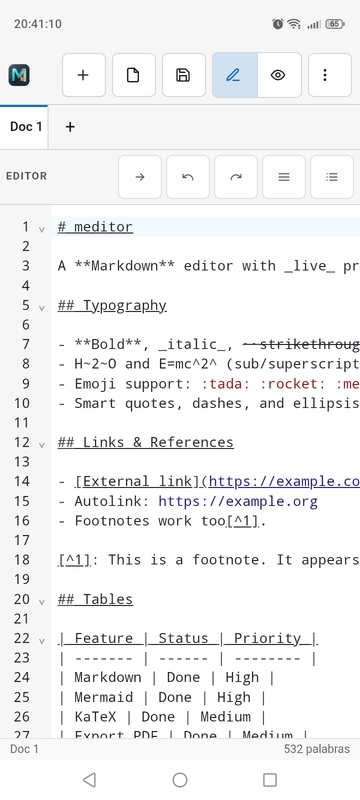
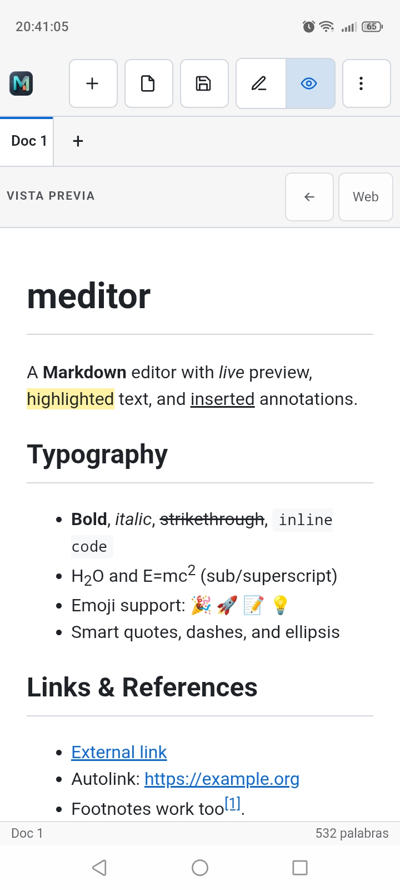

<p align="center">
  
</p>

# meditor

**Markdown and Typst editor for desktop and mobile** with live WASM preview, PDF export, and bidirectional editor↔preview sync. Built with [Tauri](https://tauri.app) (Rust) and React. Supports **104 languages**. LaTeX support is in the code but [switched off for now](#latex-switched-off-for-now).

**[Try it in the browser →](https://enacimie.github.io/meditor/)** — the same codebase as a static web build (Chromium recommended: open/save real files needs the File System Access API; elsewhere files go through upload/download).


## Features

### Extended Markdown

- **GFM**: tables, task lists, strikethrough, and autolinks.
- **Extensions**: `==highlight==`, `++inserted++`, subscript `H~2~O`, superscript `E=mc^2^`, footnotes, definition lists, abbreviations, emoji 😊, and custom containers (`::: warning`, `::: note`).
- **Math** with [KaTeX](https://katex.org): inline `$e^{i\pi}+1=0$` and block `$$ ... $$`; a number after a block, `$$ ... $$ (1)`, is set at the end of the formula's line.
- **Diagrams** [Mermaid](https://mermaid.js.org) (flowchart, sequence, gantt, etc.), rendered as **vector SVG**.
- **Code highlighting** with [highlight.js](https://highlightjs.org).

### Editing

- [CodeMirror 6](https://codemirror.net) editor with Markdown and code block syntax highlighting.
- **Multi-document tabs**: create, close, rename (double-click or **F2**), and unsaved changes indicator. Navigate with **Ctrl+Tab** / **Ctrl+Shift+Tab**.
- **Per-tab independent state** (separate undo history and scroll position).
- **Typing aids**: automatic bracket/quote pair completion, smart backspace, auto-continue for lists and blockquotes.
- **Drag & drop or paste images** into the editor. In a saved document they are written to an `assets/` folder beside it and linked, so the `.md` stays a text file; in one that has never been saved they are embedded, as they always were.
- **Images beside the document**: `` in a saved document shows the file next to it, including one a level up (`../shared/logo.png`), and travels inside the HTML export. Only the desktop can do this: Android hands the app one document with no folder around it, and a browser file handle has no parent either.
- **`[TOC]`** on a line of its own becomes a table of contents: links on screen, and in the Document view and its PDF each entry is followed by the page its heading is on, worked out after pagination rather than guessed. The marker is the one Typora and MarkText use, so the file still reads as a table of contents elsewhere.
- **Explicit page break**: `\newpage` on a line of its own, or the `<div style="page-break-after: always;"></div>` Typora writes (`page-break-before` too), starts a new sheet in the Document view and in the PDF. Both are read as markers rather than as HTML, so raw HTML stays escaped as it always was, and the file still means the same thing in the tool it came from.
- **Title, author and date** from the front-matter become a title block at the head of the document. With a title there, the running head carries the document's name on every page instead of the chapter it is in.
- **Numbered headings** with `numbersections: true` in the front-matter — Pandoc's spelling for the same switch, and off unless it is there. The numbers reach the table of contents as well, and heading anchors are unchanged, so links into the document keep working.
- **The page, from the document**: `papersize: letter` and `margin: 1in` in the front-matter lay the document out on the sheet it was written for, whatever the reader prefers. `papersize` is Pandoc's key and takes `a4paper`/`letterpaper` too; `margin` is meditor's own — Pandoc spells that one `geometry: margin=1in`, which is not read here. Millimetres, centimetres, inches and points, a bare number being millimetres. A paper this build does not know, or a margin outside 10–40 mm, leaves the preference in charge rather than overruling it on the strength of a typo.
- **Figures with numbered captions**: an image alone in its paragraph and carrying a title — `` — becomes a `<figure>` with a numbered caption. The number is worked out once, in the renderer, so the Web view, the Document view and the HTML export cannot disagree about it.
- **Tables with numbered captions**, in Pandoc's syntax: a paragraph beginning with `Table:` or `:`, right before or right after a table, becomes its caption, numbered the same way and set above the table as LaTeX does. It can hold emphasis, code or maths. After an ordinary paragraph, `:` starts a definition instead; `Table:` is a caption wherever it is.
- **Recent documents** in the menu, freshest first, with the ones that have been moved or deleted dropped. The list is kept by the backend and clicked by position: the interface is handed names to draw, never a path it could ask to have opened. Desktop only — see [docs/android.md](docs/android.md).
- **Persistence**: open/save real files and **session restoration** (tabs and content) between launches.
- **Files that change underneath you**: every open document is watched, and one rewritten by something else is reloaded when it has no unsaved changes, or raises a three-way choice — reload, keep mine, save mine elsewhere — when it has. **Reload from disk** in the menu does the same on demand, for an editor that rewrites a file without moving its timestamp, and asks first when there is unsaved work to lose.

### Interface

- **104 languages** with a searchable selector in the menu. Full RTL support (Arabic, Urdu, Persian, Pashto, Sindhi, Hebrew, etc.).
- **4 themes**: System, Light, Dark, and a **High Contrast** colorblind-friendly theme (WCAG AA everywhere).
- **Layout modes** (Ctrl+1/2/3): editor only, editor and preview, or preview only — reading a document without its source. The choice is remembered.
- **Touch**: on a touch screen the workspace is one pane at a time (splitting a phone in half helps nobody), controls grow to a 44px target, tapping the preview marks a spot without dragging you into the editor, and on-screen undo/redo appear — a touch keyboard has no Ctrl.
- **Zen mode** (F11): fullscreen distraction-free writing.
- **Keyboard shortcuts overlay** (F1) and in-window dialogs for confirm/rename (fully themed and localized).
- **Preferences** (Ctrl+,): editor font size and family, with a live sample, the spell checker toggle, the **paper size** the Document view lays out on (A4 or US Letter) and the **page margin** around the text (15 to 35 mm — the page number and the running title live in that white space, which is why it has a floor). Wide tables that fit no portrait page can be allowed to claim a landscape one (off by default — a sideways page is opt-in, and the table says so on the sheet). Everything in that list is off unless asked for, landscape tables included: **focus mode** dims everything but the paragraph being written, **typewriter mode** keeps that line in the middle of the pane, and **autosave** writes each document to its file a couple of seconds after the typing stops — off by default because this editor's model is an explicit save with a session that remembers unsaved work.
- **Spell checking** provided by the platform (Windows and macOS webviews; on Linux it also needs WebKitGTK's own setting), in the interface language.
- **Status bar** with word, line and character counts, an estimated **reading time** (200 words a minute, the figure this kind of estimate is usually given at), the caret's line and column, and the unsaved indicator.
- **Outline** (table of contents) from headings for quick navigation.

### Preview & Sync

- Two preview modes:
  - **Web**: comfortable on-screen view.
  - **Document**: **paginated pages** with [paged.js](https://pagedjs.org) and LaTeX aesthetics (**Latin Modern** font, justified text, *booktabs*-style tables, footnotes at the foot of the page that calls them, page numbers and a running title from the second page on). A4 or US Letter, chosen in Preferences.
- **Bidirectional sync** editor ↔ preview:
  - **Double-click** in preview → jumps to the corresponding line of code.
  - **"Go to preview"** and **"Go to code"** buttons in each panel.
  - Clicking in preview **marks** the position (blue outline) as a jump reference.
- **Resizable panels** by dragging the divider.

### Presentations (Marp)

A Markdown document that opens with `marp: true` front-matter becomes a slide
deck, rendered live with [Marp](https://marp.app). It is still an ordinary
`.md` file — the front-matter opts it in, and removing it turns it back into a
document.

- **Live slide preview**: every `---` on its own line starts a slide. The
  preview stacks them scaled to the pane and keeps editor ↔ preview sync at
  slide granularity.
- **The usual toolkit inside slides**: KaTeX math, highlighted code, and
  Mermaid diagrams — the same Mermaid the editor already uses, not a second
  renderer.
- **Present** (in the menu, for Marp documents): full-screen, one slide at a
  time. Arrow keys / Space / Page Down advance, Home / End jump, Esc returns to
  editing. Slides change through the View Transitions API, and elements marked
  as fragments reveal one step at a time before the deck moves on.
- **Slide transitions**: set a default with `transition:` in the front-matter
  (`fade`, `slide`, `wipe`, `zoom`, `none`, …) or per slide with a
  `<!-- transition: wipe 0.6s -->` comment on the slide it should apply to.
  meditor defaults to a visible fade; `transition: none` switches instantly.
- **Fragments** (elements that appear one step at a time): Marp marks the
  items of `*` (and `)`) lists as fragment steps, and they reveal one by one,
  exactly as Marp Bespoke paces them. Any other element can opt in with the
  `fragment` class, or a list/row's children with `fragment-list`. Only the
  presenter reveals them — the preview and exports show everything.
- **Export**: to HTML (a self-contained deck) and to PDF, one slide per page at
  the slide's own size — 16:9 or 4:3, read from the deck rather than assumed.

Themes and directives (`theme:`, `class:`, `paginate`, `<!-- fit -->`…) work as
documented upstream. meditor builds on Marp's lightweight core and reuses its
own KaTeX and highlight.js instead of Marp's optional bundles, so nothing is
duplicated.

### Export & Distribution

- **Export to PDF** vector (selectable text, vector KaTeX and Mermaid), printed by the webview with no system dialog: WebView2 on Windows, WebKitGTK on Linux and the BSDs. The sheet is the one the Document view laid out on, and it already carries its own margins, so no printer margin is added around them. Typst compiles to PDF in its own WASM engine instead, which works anywhere the file dialog does — Android included. Marp decks export one slide per page at the slide's own size. macOS has no Markdown PDF export yet.
- **Export to HTML**: a single self-contained file (styles embedded, Mermaid diagrams as inline SVG, KaTeX already expanded) that opens in any browser with no network access. Markdown documents and Marp decks.
- Packaged by `tauri build` for every desktop: **AppImage**, **deb** and **rpm** on Linux, **NSIS** and **MSI** on Windows, a universal **dmg** and `.app` on macOS. A release also carries a debug **APK** for Android.

### File associations

Installers register meditor for `.md`/`.markdown` and `.typ`/`.typst` on all desktop platforms — NSIS associations on Windows, `CFBundleDocumentTypes` on macOS (files opened from Finder are queued until the UI is ready), and on Linux the deb/rpm ship a shared-mime-info entry declaring `text/x-typst`, which upstream does not provide yet. The previous handler is backed up and restored on uninstall. `.tex`/`.latex`/`.ltx` stay unregistered while LaTeX support is disabled; build with `LATEX_ENABLED=true` to include them.

### LaTeX (switched off for now)

The LaTeX editor, preview and PDF export are in the code, but `LATEX_ENABLED`
in `src/latexSupport.ts` keeps them switched off. Their engine, SwiftLaTeX,
fetches TeX Live packages from a server whose upstream is unmaintained and has
been down for long stretches, so the preview could not be relied upon; LaTeX
comes back when an in-house Rust/WASM engine replaces it. Meanwhile the menu
offers no new LaTeX document, a `.tex` file still opens as text with a notice
where the preview would be, and it has no PDF export. To work on it, see
[Development](#development).

## Tech Stack

| Layer            | Technology                                                                                              |
| ---------------- | ------------------------------------------------------------------------------------------------------- |
| Desktop shell    | [Tauri v2](https://tauri.app) (Rust, and the system's webview: WebView2, WebKitGTK or WKWebView)         |
| Frontend         | React 19 + TypeScript + Vite                                                                            |
| Editor           | CodeMirror 6                                                                                            |
| Markdown         | markdown-it + plugins (GFM, footnote, mark, sub/sup, ins, deflist, abbr, emoji, container, texmath, highlightjs) |
| Math             | KaTeX                                                                                                   |
| Diagrams         | Mermaid                                                                                                 |
| Presentations    | Marp (@marp-team/marp-core)                                                                             |
| Code             | highlight.js                                                                                            |
| Pagination       | paged.js                                                                                                |
| Typography       | Latin Modern (GUST)                                                                                     |
| Typst            | @myriaddreamin/typst.ts (WASM compiler + SVG renderer)                                                   |
| LaTeX (off)      | SwiftLaTeX PdfTeXEngine (WASM, EPL-2.0 / GPL-2.0)                                                       |

## Prerequisites

- [Rust](https://rustup.rs) (cargo).
- [Node.js](https://nodejs.org) 20.19+ or 22.12+ (what Vite 7 requires) and [pnpm](https://pnpm.io). CI builds on 22.
- **Linux** (Ubuntu/Debian): system dependencies for Tauri/WebKitGTK:

  ```bash
  sudo apt update && sudo apt install -y \
    libwebkit2gtk-4.1-dev build-essential curl wget file \
    libsoup-3.0-dev libjavascriptcoregtk-4.1-dev \
    libxdo-dev libssl-dev libayatana-appindicator3-dev librsvg2-dev
  ```

  (You can also run `./setup.sh`, which installs everything needed.)

## Development

```bash
pnpm install
pnpm tauri dev
```

`pnpm tauri dev` starts Vite and the native window with hot reload.

LaTeX is [switched off](#latex-switched-off-for-now) in the app. To work on it,
set `LATEX_ENABLED` to `true` in `src/latexSupport.ts`, and for reproducible
compilation start the local TeX Live Ondemand service before launching the app:

```bash
docker compose -f docker-compose.texlive.yml up -d
cp .env.example .env.local
pnpm tauri dev
```

See [docs/texlive-ondemand.md](docs/texlive-ondemand.md) for endpoint checks
and shutdown instructions. Without this service, the bundled LaTeX WASM still
loads, but package resolution depends on the historical public endpoint.

> To test only the frontend in the browser: `pnpm dev`. The same codebase also
> ships as a **static web build** (`pnpm build` → `dist/`, serve anywhere):
> editing, Markdown/Typst previews, session persistence (localStorage) and
> PDF export via the browser print dialog work without a native runtime.
> File access uses the File System Access API where available (Chromium);
> other browsers fall back to open-by-upload and save-as-download, and the
> external-change watcher only covers documents opened with live handles.

### Running Tests

```bash
pnpm test:run          # Frontend unit tests (Vitest)
pnpm test:coverage     # Unit tests + V8 coverage report in coverage/
pnpm test:e2e          # E2E specs in real headless Chrome (see tests/e2e)
pnpm test:e2e:built    # The paginated specs again, against a production build
pnpm test:e2e:latex    # Opt-in: full LaTeX E2E (requires Docker TeX Live)
pnpm test:all          # Unit + E2E, one shot
pnpm verify            # Lint, typecheck, build, audit, tests, E2E, fmt, Clippy and Rust tests
cd src-tauri && cargo test --lib   # Backend tests (Rust) alone — what the gate runs
```

`test:e2e` runs against the dev server, which is not what anybody installs.
`test:e2e:built` builds the application and runs the paginated specs against
`dist/` instead, and it exists because those two are not the same thing: Vite
serves an `?inline` stylesheet verbatim while developing and minifies it on
build, and a change that reads that stylesheet can work in one and fail
completely in the other. CI runs both.

The Rust suite has one test that is not in that run: it prints a document
through WebKitGTK and counts the sheets, so it needs a display, a printer
backend that writes to a file, and a thread of its own. It is `#[ignore]`d
for that reason, and CI runs it on Linux as its own step. To repeat it
locally on Linux:

```bash
cd src-tauri
LC_ALL=C GTK_PRINT_BACKENDS=file xvfb-run -a \
  cargo test --lib -- --ignored --test-threads=1 gtk_print
```

Under WSL with WSLg there is already a display, so `xvfb-run -a` comes out.
That is where the defect it guards against was found: the Linux export was
printing a blank sheet after every page, in every released version, and no
unit test could see it.

The **pre-commit hook** (husky) runs `pnpm verify` on every commit — nothing broken lands. Skip it in an emergency with `HUSKY=0 git commit ...`.

E2E specs live in `tests/e2e/` and use a zero-dependency CDP driver (`cdp.mjs`) against a real headless Chrome. They cover dialogs and the window close guard (with a faithful Tauri IPC shim), the themes' contrast, pagination and printing to PDF, images beside the document, Marp and Typst, the keyboard shortcuts and the web build; `pnpm test:e2e:built` runs the paginated ones again against a production build, under the desktop app's Content-Security-Policy. CI additionally runs dependency auditing, lint, TypeScript, V8 coverage, Rust formatting and Clippy. The expensive full LaTeX + Docker verification is available as the manually triggered `LaTeX integration` GitHub Actions workflow, so ordinary pull requests do not download several GB of TeX Live.

## Build

```bash
pnpm tauri build
```

Produces (in `src-tauri/target/release/bundle/`):

- `appimage/meditor_<version>_amd64.AppImage`
- `deb/meditor_<version>_amd64.deb`
- `rpm/meditor-<version>-1.x86_64.rpm`

To run the AppImage on distros without FUSE: `./meditor_*.AppImage --appimage-extract-and-run` (or install `libfuse2`).

### Windows

> **Smart App Control blocks the downloaded installer.** The installers are not
> code signed, and Windows 11 refuses to run an unsigned executable that came
> from the internet. An installer you build yourself carries no mark of the web
> and runs normally. **Do not switch Smart App Control off to get around it** —
> on Windows 11 that cannot be undone without reinstalling.
>
> [docs/windows.md](docs/windows.md) has the full picture, the workarounds, and
> what signing would take.

### Android

meditor runs on Android: editing, the live preview, session restore, a layout
built for a finger rather than a mouse, and opening and saving real files
through the Storage Access Framework. PDF export works for Typst, which
compiles in the frontend's WASM, but not for Markdown, which needs the
webview's native printing — that menu entry is hidden there rather than left to
fail. See [docs/android.md](docs/android.md) for the two limits worth knowing
about, how to build a debug APK, and where to download one from CI without a
local toolchain.





```bash
source scripts/android-env.sh   # SDK, NDK, JDK, Rust targets, Tauri CLI
pnpm build                      # the frontend bundle
./scripts/android-build.sh      # the APK
```

### iOS

Unknown, and honestly so — nobody on the project has a Mac, an iPhone or an
Apple developer account, and the CLI's `ios` subcommand does not even exist off
macOS. The **iOS probe** workflow (Actions → Run workflow) generates the Xcode
project and attempts an unsigned simulator build, then reports how far it got.
See [docs/ios.md](docs/ios.md).

The app *should* run on Apple devices — the stack supports iOS — but
distributing to them requires Apple's paid, proprietary developer program, and
this project does not pay for proprietary developer licenses. iOS stays an
unsigned probe until someone with an Apple account carries it.

### Testing

Not every platform is tested by hand. [docs/testing.md](docs/testing.md) lists
who tests what, and which targets are still unreviewed (rpm, macOS, iOS…).

## Keyboard Shortcuts

| Shortcut        | Action          |
| --------------- | --------------- |
| `Ctrl+N` / `Ctrl+T` | New document |
| `Ctrl+Shift+N`  | New Typst document |
| `Ctrl+O`        | Open file(s)    |
| `Ctrl+S`        | Save            |
| `Ctrl+Shift+S`  | Save as         |
| `Ctrl+E`        | Export to PDF   |
| `Ctrl+W`        | Close tab       |
| `Ctrl+Shift+T`  | Reopen the last closed tab |
| `Ctrl+Q`        | Quit            |
| `Ctrl+P`        | Print           |
| `Ctrl+Tab` / `Ctrl+Shift+Tab` | Next / previous tab |
| `Ctrl+B` / `Ctrl+I` | Bold / italic (Markdown or Typst) |
| `Ctrl+F`        | Find, from anywhere in the window |
| `Ctrl+K`        | Insert a link (Markdown or Typst) |
| `Ctrl+H`        | Find & replace  |
| `Ctrl+G`        | Go to line      |
| `Ctrl+,`        | Preferences     |
| `F1`            | Shortcuts overlay |
| `F2`            | Rename tab      |
| `Ctrl+1`        | Editor only     |
| `Ctrl+2`        | Editor and preview |
| `Ctrl+3`        | Preview only    |
| `F11`           | Zen mode        |

Press **F1** anytime for the full list. Also: **double-click** in preview to jump to code, and **drag the divider** to resize panels.

## Project Structure

```
meditor/
├── index.html
├── src/
│   ├── main.tsx              # React entry point
│   ├── App.tsx               # Global state, tabs, sync, and panels
│   ├── App.css               # Styles (screen and print)
│   ├── Editor.tsx            # CodeMirror 6 (per-tab state)
│   ├── Preview.tsx           # Render + mermaid + pagination (paged.js)
│   ├── markdown.ts           # markdown-it config + data-line
│   ├── paged.css             # Document view styles (the printed page)
│   ├── pageSetup.ts          # The paper and its margins, in one place
│   ├── frontMatter.ts        # The YAML block at the top, read once
│   ├── sample.ts             # Sample document
│   ├── documentUtils.ts      # Document kind detection/normalization
│   ├── sanitizeSvg.ts        # SVG allowlist sanitization
│   ├── types.ts              # Shared types
│   ├── ErrorBoundary.tsx     # React error boundary
│   ├── TypstPreview.tsx      # Typst WASM compiler + SVG preview
│   ├── LatexPreview.tsx      # SwiftLaTeX WASM compiler + PDF preview
│   ├── MarpPreview.tsx       # Marp slide preview + slide↔source sync
│   ├── marpEngine.ts         # Configured Marp converter (slides → HTML+CSS)
│   ├── marpDetect.ts         # `marp: true` front-matter detection
│   ├── marpSlides.ts         # Map slides to their source lines (sync)
│   ├── marpPresent.ts        # Parse `transition` presentation directives
│   ├── i18n/                 # Internationalization
│   │   ├── I18nProvider.tsx  # Language context, storage, browser detection
│   │   └── translations/     # en.ts + 103 more language files (parity-tested)
│   ├── hooks/                # useThemeEffect, useSplitDivider, useKeyboardShortcuts…
│   ├── components/           # Topbar, TabBar, dialogs, LanguagePicker, ShortcutsOverlay, PresentOverlay…
│   └── assets/fonts/         # Latin Modern fonts (GUST)
├── src-tauri/
│   ├── src/lib.rs            # Start-up: plugins, state, and the list of commands the modules below provide
│   ├── src/document.rs       # The document the frontend sees; open and save
│   ├── src/export.rs         # Print and PDF/HTML export: WebView2 and WebKitGTK
│   ├── src/image.rs          # Images beside the document: safe paths and safe names
│   ├── src/locale.rs         # Localized backend error messages
│   ├── src/location.rs       # Paths, content URIs, the handle registry, atomic writes
│   ├── src/paper.rs          # The sheet and the margin both print paths agree on
│   ├── src/recent.rs         # The recent documents, opened by position
│   ├── src/recent_menu.rs    # recent.json and the two commands that read it
│   ├── src/session.rs        # session.json: the tabs that come back, and their fingerprints
│   ├── src/startup.rs        # Files arriving from argv, a second launch, or the Finder
│   ├── src/system.rs         # Platform name, exit, and the native alert dialog
│   ├── tauri.conf.json
│   ├── capabilities/         # Permissions (dialog, opener; updater and process on desktop)
│   ├── gen/android/          # Android project (generated once, then committed)
│   └── Cargo.toml
├── scripts/                  # tauri.mjs (the CLI forwarder), android-env.sh, android-build.sh
├── docs/android.md           # Building and installing the Android app
├── docs/ios.md               # The iOS probe workflow
├── docs/testing.md           # Who tests which platform, and what is unreviewed
├── docs/windows.md           # Smart App Control and the unsigned installer
├── docs/texlive-ondemand.md  # The local TeX Live service for LaTeX
├── tests/e2e/                # CDP-driven E2E harness (cdp.mjs, run.mjs, specs)
└── setup.sh                  # Install system dependencies (Linux)
```

## Fonts

The **Latin Modern** fonts included in `src/assets/fonts/` are distributed under the [GUST Font License](src/assets/fonts/GUST-FONT-LICENSE.TXT) (free). See the accompanying license file.

Typst's default fonts ship in `public/typst-fonts/`, the same files typst.ts would otherwise download from a CDN (typst-assets v0.13.1): **Libertinus Serif** under the SIL Open Font License 1.1, **New Computer Modern** under the GUST Font License, and **DejaVu Sans Mono** under the Bitstream Vera terms. Their licences travel with them ([NOTICE](public/typst-fonts/NOTICE), [GUST](public/typst-fonts/GUST-FONT-LICENSE.TXT)). Typst therefore needs no network for its fonts.

## License

meditor is licensed under the **GNU Affero General Public License v3.0** (AGPL-3.0-or-later). See [LICENSE](LICENSE) for the full text.

The **Latin Modern** fonts are under the [GUST Font License](src/assets/fonts/GUST-FONT-LICENSE.TXT) (free). Typst's fonts in `public/typst-fonts/` keep their own free licences (see [Fonts](#fonts)).

**SwiftLaTeX** (PdfTeXEngine) is under EPL-2.0 / GPL-2.0 with Classpath exception.
