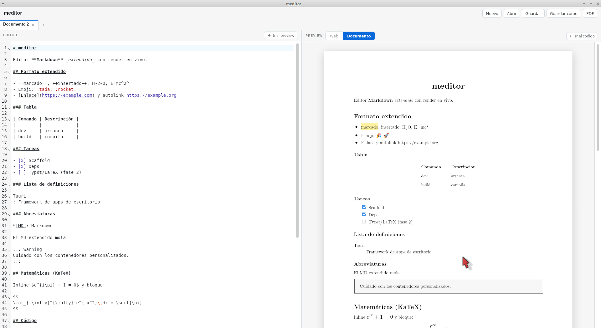

# meditor

**Desktop Markdown/Typst/LaTeX editor** with live WASM preview, PDF export, and bidirectional editor↔preview sync. Built with [Tauri](https://tauri.app) (Rust) and React. Supports **104 languages** and 3 document formats.



## Features

### Extended Markdown

- **GFM**: tables, task lists, strikethrough, and autolinks.
- **Extensions**: `==highlight==`, `++inserted++`, subscript `H~2~O`, superscript `E=mc^2^`, footnotes, definition lists, abbreviations, emoji 😊, and custom containers (`::: warning`, `::: note`).
- **Math** with [KaTeX](https://katex.org): inline `$e^{i\pi}+1=0$` and block `$$ ... $$`.
- **Diagrams** [Mermaid](https://mermaid.js.org) (flowchart, sequence, gantt, etc.), rendered as **vector SVG**.
- **Code highlighting** with [highlight.js](https://highlightjs.org).

### Editing

- [CodeMirror 6](https://codemirror.net) editor with Markdown and code block syntax highlighting.
- **Multi-document tabs**: create, close, rename (double-click or **F2**), and unsaved changes indicator. Navigate with **Ctrl+Tab** / **Ctrl+Shift+Tab**.
- **Per-tab independent state** (separate undo history and scroll position).
- **Typing aids**: automatic bracket/quote pair completion, smart backspace, auto-continue for lists and blockquotes.
- **Drag & drop or paste images** into the editor — they are inlined as markdown and previewed live.
- **Persistence**: open/save real files and **session restoration** (tabs and content) between launches.

### Interface

- **104 languages** with a searchable selector in the menu. Full RTL support (Arabic, Urdu, Persian, Pashto, Sindhi, Hebrew, etc.).
- **4 themes**: System, Light, Dark, and a **High Contrast** colorblind-friendly theme (WCAG AA everywhere).
- **Zen mode** (F11): fullscreen distraction-free writing.
- **Keyboard shortcuts overlay** (F1) and in-window dialogs for confirm/rename (fully themed and localized).
- **Status bar** with word/line/character counts and unsaved indicator.
- **Outline** (table of contents) from headings for quick navigation.

### Preview & Sync

- Two preview modes:
  - **Web**: comfortable on-screen view.
  - **Document**: **paginated A4 pages** with [paged.js](https://pagedjs.org) and LaTeX aesthetics (**Latin Modern** font, justified text, *booktabs*-style tables).
- **Bidirectional sync** editor ↔ preview:
  - **Double-click** in preview → jumps to the corresponding line of code.
  - **"Go to preview"** and **"Go to code"** buttons in each panel.
  - Clicking in preview **marks** the position (blue outline) as a jump reference.
- **Resizable panels** by dragging the divider.

### Export & Distribution

- **Export to PDF** vector (selectable text, vector KaTeX and Mermaid) via WebKitGTK printing, without system dialog. A4 format with 2.5 cm margins on Linux. Typst and LaTeX export use their WASM engines on supported desktop targets.
- **Export to HTML**: a single self-contained file (styles embedded, Mermaid diagrams as inline SVG, KaTeX already expanded) that opens in any browser with no network access. Markdown documents only.
- Packaged as **AppImage**, **deb**, and **rpm** via `tauri build`.

## Tech Stack

| Layer            | Technology                                                                                              |
| ---------------- | ------------------------------------------------------------------------------------------------------- |
| Desktop shell    | [Tauri v2](https://tauri.app) (Rust + WebKitGTK)                                                        |
| Frontend         | React 19 + TypeScript + Vite                                                                            |
| Editor           | CodeMirror 6                                                                                            |
| Markdown         | markdown-it + plugins (GFM, footnote, mark, sub/sup, ins, deflist, abbr, emoji, container, texmath, highlightjs) |
| Math             | KaTeX                                                                                                   |
| Diagrams         | Mermaid                                                                                                 |
| Code             | highlight.js                                                                                            |
| Pagination       | paged.js                                                                                                |
| Typography       | Latin Modern (GUST)                                                                                     |
| Typst            | @myriaddreamin/typst.ts (WASM compiler + SVG renderer)                                                   |
| LaTeX            | SwiftLaTeX PdfTeXEngine (WASM, EPL-2.0 / GPL-2.0)                                                       |

## Prerequisites

- [Rust](https://rustup.rs) (cargo).
- [Node.js](https://nodejs.org) 20+ and [pnpm](https://pnpm.io).
- **Linux** (Ubuntu/Debian): system dependencies for Tauri/WebKitGTK:

  ```bash
  sudo apt update && sudo apt install -y \
    libwebkit2gtk-4.1-dev build-essential curl wget file \
    libsoup-3.0-dev libjavascriptcoregtk-4.1-dev \
    libxdo-dev libssl-dev libayatana-appindicator3-dev librsvg2-dev
  ```

  (You can also run `./setup.sh`, which installs everything needed.)

## Development

```bash
pnpm install
pnpm tauri dev
```

`pnpm tauri dev` starts Vite and the native window with hot reload.

For reproducible LaTeX compilation, start the local TeX Live Ondemand service
before launching the app:

```bash
docker compose -f docker-compose.texlive.yml up -d
cp .env.example .env.local
pnpm tauri dev
```

See [docs/texlive-ondemand.md](docs/texlive-ondemand.md) for endpoint checks
and shutdown instructions. Without this service, the bundled LaTeX WASM still
loads, but package resolution depends on the historical public endpoint.

> To test only the frontend in the browser: `pnpm dev` (desktop features — open/save, PDF, and session — require the native app).

### Running Tests

```bash
pnpm test:run          # Frontend unit tests (Vitest)
pnpm test:coverage     # Unit tests + V8 coverage report in coverage/
pnpm test:e2e          # E2E specs in real headless Chrome (see tests/e2e)
pnpm test:e2e:latex    # Opt-in: full LaTeX E2E (requires Docker TeX Live)
pnpm test:all          # Unit + E2E, one shot
pnpm verify            # Lint, typecheck, audit, tests, E2E, fmt, Clippy and Rust tests
cargo test -p meditor  # Backend tests (Rust) alone
```

The **pre-commit hook** (husky) runs `pnpm verify` on every commit — nothing broken lands. Skip it in an emergency with `HUSKY=0 git commit ...`.

E2E specs live in `tests/e2e/` and use a zero-dependency CDP driver (`cdp.mjs`) against a real headless Chrome: dialogs and the window close guard (with a faithful Tauri IPC shim), the high-contrast theme's WCAG ratios, and the keyboard shortcuts. CI additionally runs dependency auditing, lint, TypeScript, V8 coverage, Rust formatting and Clippy. The expensive full LaTeX + Docker verification is available as the manually triggered `LaTeX integration` GitHub Actions workflow, so ordinary pull requests do not download several GB of TeX Live.

## Build

```bash
pnpm tauri build
```

Produces (in `src-tauri/target/release/bundle/`):

- `appimage/meditor_<version>_amd64.AppImage`
- `deb/meditor_<version>_amd64.deb`
- `rpm/meditor-<version>-1.x86_64.rpm`

To run the AppImage on distros without FUSE: `./meditor_*.AppImage --appimage-extract-and-run` (or install `libfuse2`).

## Keyboard Shortcuts

| Shortcut        | Action          |
| --------------- | --------------- |
| `Ctrl+N`        | New document    |
| `Ctrl+O`        | Open file(s)    |
| `Ctrl+S`        | Save            |
| `Ctrl+Shift+S`  | Save as         |
| `Ctrl+E`        | Export to PDF   |
| `Ctrl+W`        | Close tab       |
| `Ctrl+Tab` / `Ctrl+Shift+Tab` | Next / previous tab |
| `Ctrl+F`        | Find            |
| `Ctrl+K`        | Focus the find field |
| `Ctrl+H`        | Find & replace  |
| `Ctrl+G`        | Go to line      |
| `F1`            | Shortcuts overlay |
| `F2`            | Rename tab      |
| `F11`           | Zen mode        |

Press **F1** anytime for the full list. Also: **double-click** in preview to jump to code, and **drag the divider** to resize panels.

## Project Structure

```
meditor/
├── index.html
├── src/
│   ├── main.tsx              # React entry point
│   ├── App.tsx               # Global state, tabs, sync, and panels
│   ├── App.css               # Styles (screen and print)
│   ├── Editor.tsx            # CodeMirror 6 (per-tab state)
│   ├── Preview.tsx           # Render + mermaid + pagination (paged.js)
│   ├── markdown.ts           # markdown-it config + data-line
│   ├── paged.css             # Document view styles (A4)
│   ├── sample.ts             # Sample document
│   ├── session.ts            # Session serialization types/helpers
│   ├── documentUtils.ts      # Document kind detection/normalization
│   ├── sanitizeSvg.ts        # SVG allowlist sanitization
│   ├── types.ts              # Shared types
│   ├── ErrorBoundary.tsx     # React error boundary
│   ├── TypstPreview.tsx      # Typst WASM compiler + SVG preview
│   ├── LatexPreview.tsx      # SwiftLaTeX WASM compiler + PDF preview
│   ├── i18n/                 # Internationalization
│   │   ├── I18nProvider.tsx  # Language context, storage, browser detection
│   │   └── translations/     # en.ts + 102 more language files (parity-tested)
│   ├── hooks/                # useThemeEffect, useSplitDivider, useKeyboardShortcuts…
│   ├── components/           # Topbar, TabBar, dialogs, LanguagePicker, ShortcutsOverlay…
│   └── assets/fonts/         # Latin Modern fonts (GUST)
├── src-tauri/
│   ├── src/lib.rs            # Commands: read/save, session, and PDF export
│   ├── src/locale.rs         # Localized backend error messages
│   ├── tauri.conf.json
│   ├── capabilities/         # Permissions (dialog, opener)
│   └── Cargo.toml
├── tests/e2e/                # CDP-driven E2E harness (cdp.mjs, run.mjs, specs)
└── setup.sh                  # Install system dependencies (Linux)
```

## Fonts

The **Latin Modern** fonts included in `src/assets/fonts/` are distributed under the [GUST Font License](src/assets/fonts/GUST-FONT-LICENSE.TXT) (free). See the accompanying license file.

## License

meditor is licensed under the **GNU Affero General Public License v3.0** (AGPL-3.0-or-later). See [LICENSE](LICENSE) for the full text.

The **Latin Modern** fonts are under the [GUST Font License](src/assets/fonts/GUST-FONT-LICENSE.TXT) (free).

**SwiftLaTeX** (PdfTeXEngine) is under EPL-2.0 / GPL-2.0 with Classpath exception.

## Recommended IDE

- [VS Code](https://code.visualstudio.com/) + [Tauri](https://marketplace.visualstudio.com/items?itemName=tauri-apps.tauri-vscode) + [rust-analyzer](https://marketplace.visualstudio.com/items?itemName=rust-lang.rust-analyzer)
